# Linate
Linate, a linux associate , is a CLI tool for Linux systems. It's a unified tool that helps you to do many things 
from a single place. Linux users run commands and may open many files to do a single task. With linate you will 
run simple commands to perform complex tasks. Right now linate comes with 4 commands and associated sub commands.
More commands are coming.
> [!NOTE]
> For bug reporting, feedback, and command suggestion please send an email to safaetxaamil@gmail.com .

## Installation
```
curl -O https://github.com/safatjamil/linate/releases/download/v1stable/linate
sudo install linate -t /usr/local/bin
```

## Commands
## 1) bk
### Sub commands
**1.1) bk take**
<br/>Take backup of a file. The backup filename will be \<oldFilename>-\<year>\<month>\<day>-\<count>.<br />
The backup file will be created in the same directory as the original file.<br/>
If your file is in the current directory you do not need the --dir flag.<br/>
**Flags**
```
--dir     directory of the original file that needs to be backed up. Default is the current directory
--file    name of the file
```
>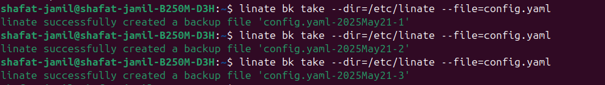

**1.2) bk check**
<br/>Check backup files from the newest to the oldest.<br/>
If your file is in the current directory you do not need the --dir flag.<br/>
**Flags**
```
--dir     directory where you want to check the backup files. Default is the current directory
--file    name of the file
```
>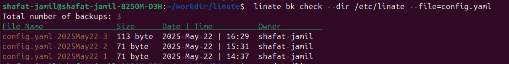

**1.3) bk delete**
<br/>Delete backup files. The oldest one will be deleted first. Yes/no promt will be shown for confirmation.<br/>
If your file is in the current directory you do not need the --dir flag.<br/>
**Flags**
```
--dir     directory where the backup files are located. Default is the current directory
--file    name of the file
--number  number of backup to delete. The default is 1
```
>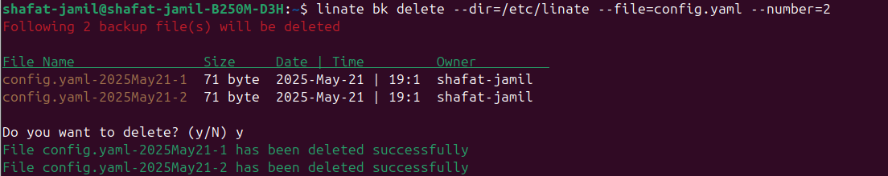

## 2) info
### Sub commands
**2.1) info os**
<br/>Get information about the OS, kernel, CPU, memory and others.<br />
**Flags**
> No flags<br/>
>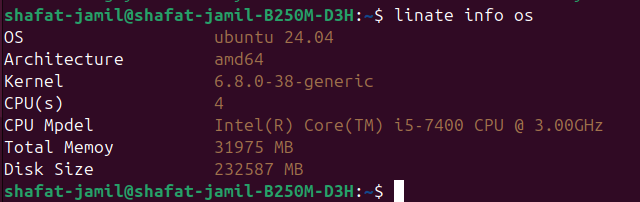

**2.2) info process**
<br/>List processes. Sort by memory and CPU usage.<br />
**Flags**
```
--sort   available options are mem, cpu, and longrun
```
>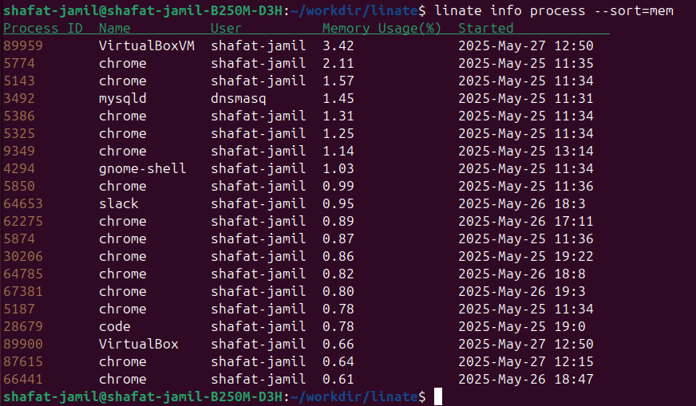</br>
>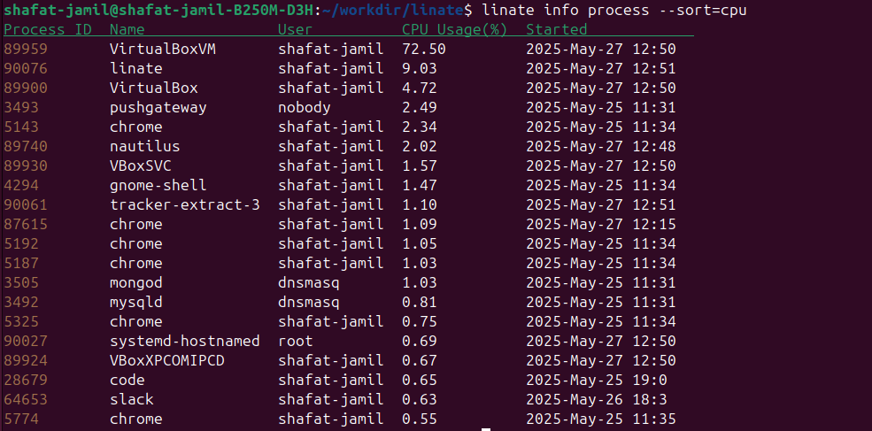</br>
>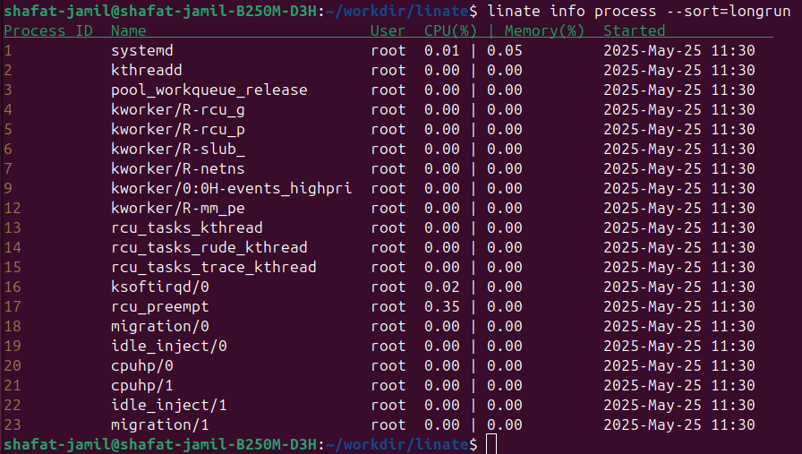

**2.3) info memory**
<br/>Get information about the memory usage, free and cached memory.<br />
**Flags**
> No flags<br/>
>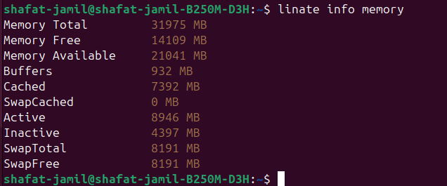

**2.4) info load**
<br/>Get information about the system load. Load1, load5 and load15.<br />
**Flags**
> No flags<br/>
>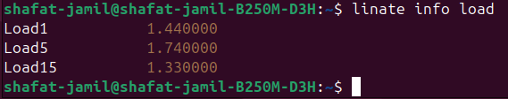

**2.5) info users**
<br/>Get information about the system users.<br />
**Flags**
> No flags<br/>
>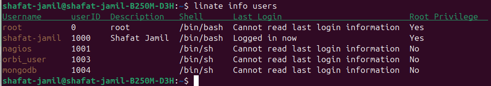

## 3) net
### Sub commands
**3.1) net details**
<br/>Information about network interfaces and gateway.<br />
**Flags**
> No flags<br/>
>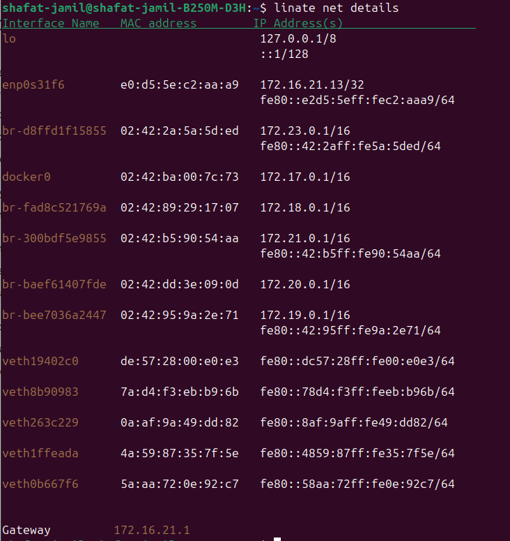

**3.2) net socket**
<br/>Information about listening and established sockets. Shows services instead of ports.</br>
You can get an overview of the services that are running on the machine.<br />
**Flags**
> No flags<br/>
>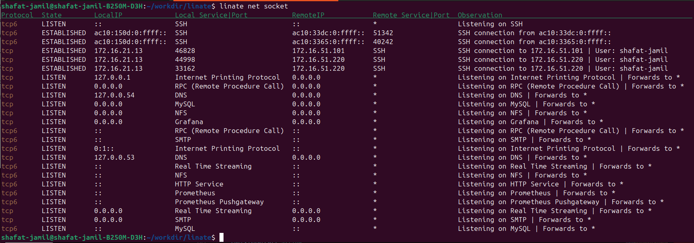

**3.3) net conn**
<br/>Check internet connection.<br />
**Flags**
> No flags<br/>
>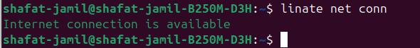

## 4) version
See the version of linate
